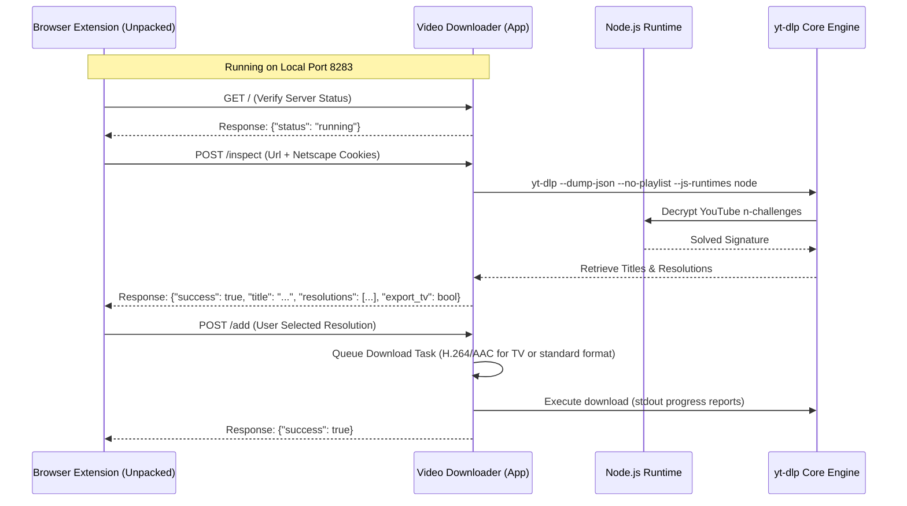

# Video Downloader
[](https://github.com/Aadiwrth/Video-Downloader/releases)
[](https://www.python.org/)
[](https://flet.dev/)
[](LICENSE.txt)

A clean, modern, and high-performance desktop application for downloading videos and audio from hundreds of popular platforms (such as YouTube, Twitter, and others). Developed by **aadiwrth**, this app features a state-of-the-art UI, an IDM-style browser extension, TV compatibility options, and extreme download speed engines.

 **GitHub Repository:** [https://github.com/Aadiwrth/Video-Downloader](https://github.com/Aadiwrth/Video-Downloader)

---

## Features

- **IDM-Style Browser Extension:** Inspect video pages directly inside Chrome/Firefox/Edge. The extension extracts and converts active cookies to Netscape format, pulls stream quality resolutions, and sends downloads directly to the desktop application.
- **TV Compatibility Export:** Converts video streams specifically for non-smart or older TVs by forcing the **H.264 (AVC1)** video codec and **AAC** audio codec merged into standard `.mp4` containers. It also includes warnings if you try to export higher resolutions (>1080p) that older TV processors cannot play.
- **Aria2 Extreme Speed Engine:** Option to toggle `aria2c` as an external segmented downloader using 16 concurrent connection streams, accelerating downloads by up to 10x.
- **Advanced yt-dlp Configuration:** Text input to override or append custom command-line arguments (such as `--limit-rate` or custom User Agents) while preserving dynamic variables like directories and cookies.
- **Adaptive Visual Themes:** Dynamic light/dark mode switch and a color picker supporting 7 accent themes (Blue, Purple, Green, Orange, Red, Teal, Pink) updating the interface instantly.
- **Persistent App State:** Preloads your preferred save folder, active theme, and dialog settings automatically on launch.
- **ISP/Network Block Bypass Guide:** A built-in startup dialog offering instructions on configuring Secure DNS (e.g., NextDNS or Cloudflare) to bypass provider-level blocks on restricted content.
- **Defensive Error Handling:** Queue operations run asynchronously and are fully wrapped in try-catch logic, ensuring a failing link never blocks the rest of the queue.

---

## How It Works (Extension & App Pipeline)



---

## Installation & Setup

### Option 1: Standalone Portable Executable (Recommended)
You do not need to install Python, Node.js, or any packages manually.
1. Head over to the [Releases](https://github.com/Aadiwrth/Video-Downloader/releases) tab.
2. Download the latest **`VideoDownloader.exe`**.
3. Move it to a folder of your choice and launch the application!

### Option 2: Running from Source (Development)
#### Prerequisites:
- **Python 3.8+** (Ensure it is added to your environment `PATH`).
- **Node.js** (Installed and in system variables. Required for solving YouTube signature challenges).
- **Aria2** (Optional. Add `aria2c` to environment variables if you want to use the extreme speed engine).

#### Steps:
1. Clone the repository:
   ```bash
   git clone https://github.com/Aadiwrth/Video-Downloader.git
   cd Video-Downloader
   ```
2. Install Python dependencies:
   ```bash
   pip install -r requirements.txt
   ```
   *(Or simply run `pip install flet pyinstaller` if `requirements.txt` is not present).*
3. Run the application:
   ```bash
   python src/main.py
   ```

---

## Installing the Browser Extension Helper

The custom browser extension grabs session cookies automatically so that age-restricted, private, or cookies-dependent links download successfully.

1. Open Google Chrome (or Microsoft Edge / Brave / Opera).
2. Navigate to **`chrome://extensions/`** in the address bar.
3. Turn **ON** **Developer mode** (the toggle switch in the top-right corner).
4. Click **Load unpacked** (button in the top-left corner).
5. Select the **`src/extension`** folder from this cloned repository directory.
6. The extension is now active! Pin it to your toolbar. When on a video page, open it to select your resolution and send the download straight to the desktop app.

---

## Standalone Compilation (.exe)

To bundle the Python codebase into a single, clean `.exe` binary:
1. Ensure `pyinstaller` is installed:
   ```bash
   pip install pyinstaller flet
   ```
2. Create the compilation package:
   ```bash
   pyinstaller VideoDownloader.spec --clean -y
   ```
3. The standalone binary will be available inside `src/dist/VideoDownloader.exe`.

---

## License
This project is licensed under the MIT License - see the [LICENSE.txt](LICENSE.txt) file for details.
